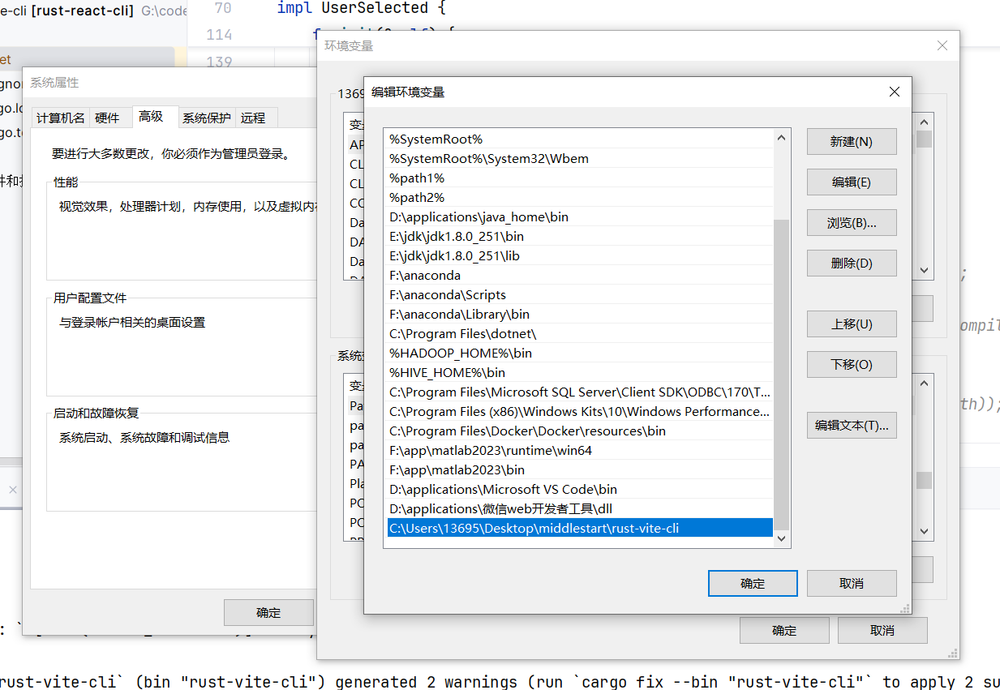

# rust-cli

命令行快速创建vite/nextjs项目

# 使用

## 1. 下载 或 git clone 该库

```shell
git clone https://gitee.com/malguy/rust-vite-cli.git
```

## 2. 编译 或 将根目录的release-v1文件夹放到想要放的地方

我编译的环境是win10 x86 intel

> 想要全局使用请配置环境变量


## 3. 在命令行中运行

创建vite项目

```shell
> rust-cli create-vite

your project name? (vite-project)

select a framework: (default: react)
react
vue

select a variant: (default: ts)
typescript(ts)
javascript(js)

复制 C:\Users\13695\Desktop\middlestart\rust-vite-cli\/public/vite/react-ts
```

创建next项目

```shell
> rust-cli create-next

What is your project named? >> my-app

Would you like to use TypeScript? >> No/Yes(default)

Would you like to use ESLint? >> No/Yes(default)

Would you like to use Tailwind CSS? >> No/Yes(default)

Would you like to use `src/` directory? >> No(default)/Yes

Would you like to use App Router? (recommended) >> No/Yes(default)

Would you like to customize the default import alias (@/*)? >> No(default)/Yes

复制 C:\Users\13695\Desktop\middlestart\rust-vite-cli\/public/nextjs/ts-lint-tailwind-app
```

# 更新日志

- 支持创建项目后自动安装
